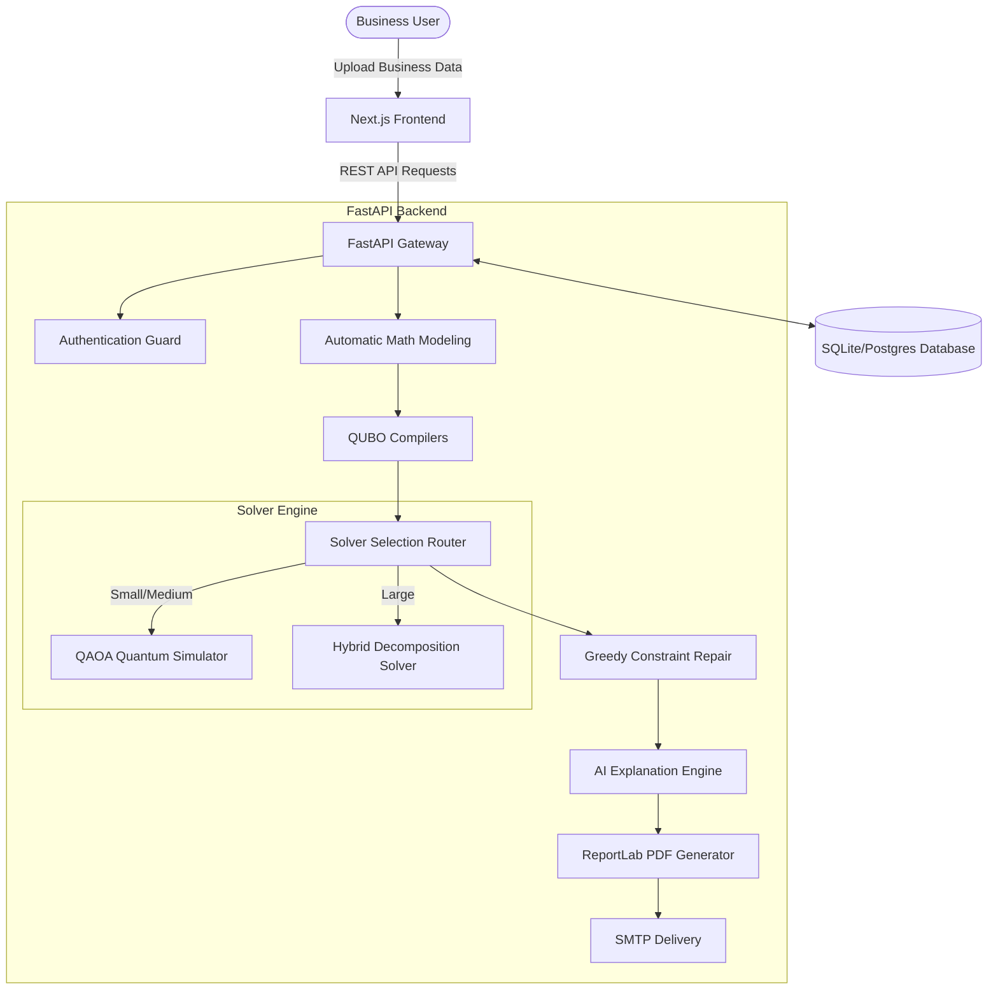

# Enterprise Quantum Optimization-as-a-Service (QOaaS) Platform

A production-quality enterprise SaaS platform that enables business users (HR managers, Portfolio Analysts, Operations teams) to run complex optimizations (Portfolio Allocation and Staffing Schedules) using quantum-classical hybrid algorithms without needing to know any quantum physics, circuits, QUBO, or coding.

---
## Team Member Contributions

Mahati Kanigiri  
Email: [mahathikanigiri@gmail.com](mailto:mahathikanigiri@gmail.com)

Contributed to QUBO formulation, mathematical modeling, and technical research on quantum optimization methods and their application to the QOaaS platform.

Sai Krishna Thopul  
Email: [saikrishnathopula36@gmail.com](mailto:saikrishnathopula36@gmail.com)

Contributed to data analysis, documentation, and presentation development, including organizing project findings and effectively communicating the platform’s objectives, methodology, and results. Affiliated with Cyient.

Sandhya Pancheti  
Email: [panchetisandhya@gmail.com](mailto:panchetisandhya@gmail.com)

Led the coding, software development, and technical implementation of the QOaaS platform, including platform architecture, feature development, optimization workflow integration, and implementation of the hybrid quantum–classical execution pipeline.

## Project Resources

Project Demonstration Video

[Watch the QOaaS Platform Demonstration Video](https://drive.google.com/file/d/1yTeK4QqZv4-ke8y-d9WOjnqyqcoWVNyQ/view?usp=drivesdk)

Project Documentation

[View the QOaaS Platform Documentation](https://drive.google.com/file/d/1ZMbem-nRARMnp_MwGljoXLiCYwpIgnbm/view?usp=drivesdk)



---

## Core Internal Modules

1. **Automatic Mathematical Modeling (`modeling.py`)**: Parses row datasets (assets, returns, risk, employee costs, availability) and synthesizes them into formal mathematical variables and objective targets.
2. **Automatic QUBO Generator (`qubo.py`)**: Discretizes continuous variables into binary representations and converts boundary constraints into quadratic penalty parameters ($P$).
3. **Solver Selection Engine (`quantum.py`)**: Routes small jobs to direct QAOA statevector simulation, and large jobs to a Hybrid Decomposition Solver which breaks down QUBO matrices and resolves blocks iteratively.
4. **Constraint Repair Engine (`quantum.py`)**: Normalizes weight bounds for portfolios and repairs scheduling coverage deficits to guarantee valid, business-compliant outputs.
5. **AI Explanation Engine (`ai.py`)**: Translates optimization metrics into professional executive summaries and recommendations using GPT models (or heuristic template fallbacks).
6. **Executive PDF & SMTP Mailer (`reports.py` & `email.py`)**: Compiles ReportLab executive PDFs and dispatches them via SMTP notification.
7. **Quantum Random Number Generator (`qrng.py`)**: Queries physical quantum vacuum entropy (ANU QRNG API with local Qiskit Hadamard fallback) to generate cryptographically random verification tokens.

---

## Directory Structure

```
qoaas-platform/
├── docker-compose.yml              # Multi-container service configuration
├── README.md                       # System and setup documentation
├── backend/
│   ├── Dockerfile
│   ├── requirements.txt            # Python scientific & web packages
│   └── app/
│       ├── main.py                 # FastAPI Gateway entrypoint
│       ├── config.py               # Environmental configs
│       ├── api/                    # Routers & authentication dependencies
│       ├── core/                   # Databases & QRNG helper
│       ├── models/                 # SQLAlchemy schemas (SQLite/Postgres)
│       └── services/               # Modeling, QUBO, Quantum, Reports, Mail, QRNG
└── frontend/
    ├── Dockerfile
    ├── package.json                # Next.js 15, Recharts, Framer Motion
    ├── tailwind.config.js          # Neon dark theme configs
    └── app/
        ├── layout.tsx              # Root wrapper
        ├── globals.css             # Glassmorphism design tokens
        └── page.tsx                # Master dashboard interface
```

---

## Setup & Running the Platform

### Option A: Running via Docker Compose (Recommended)
Make sure you have Docker and Docker Compose installed, then execute:
```bash
docker compose up --build
```
- **Frontend Panel**: `http://localhost:3000`
- **FastAPI Gateway**: `http://localhost:8000`
- **API Swagger Documentation**: `http://localhost:8000/docs`

### Option B: Local Manual Setup (Development Mode)

#### 1. Setup Backend
1. Move to backend directory and create a virtual environment:
   ```bash
   cd backend
   python3 -m venv venv
   source venv/bin/activate
   ```
2. Install packages:
   ```bash
   pip install -r requirements.txt
   ```
3. Start the FastAPI server:
   ```bash
   uvicorn app.main:app --reload --port 8000
   ```

#### 2. Setup Frontend
1. Move to frontend directory:
   ```bash
   cd ../frontend
   ```
2. Install dependencies:
   ```bash
   npm install
   ```
3. Launch development server:
   ```bash
   npm run dev
   ```
4. Access `http://localhost:3000` in your web browser.

---

## Verification & Unit Testing

We include unit tests for core compilers and simulation services. To run tests:
1. Ensure your backend virtualenv is active.
2. Create a test directory or run directly using pytest:
   ```bash
   cd backend
   python3 -m pytest
   ```
